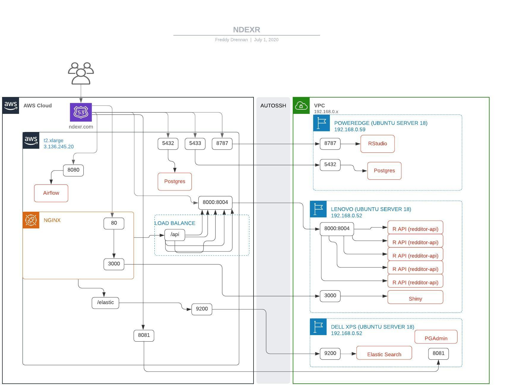
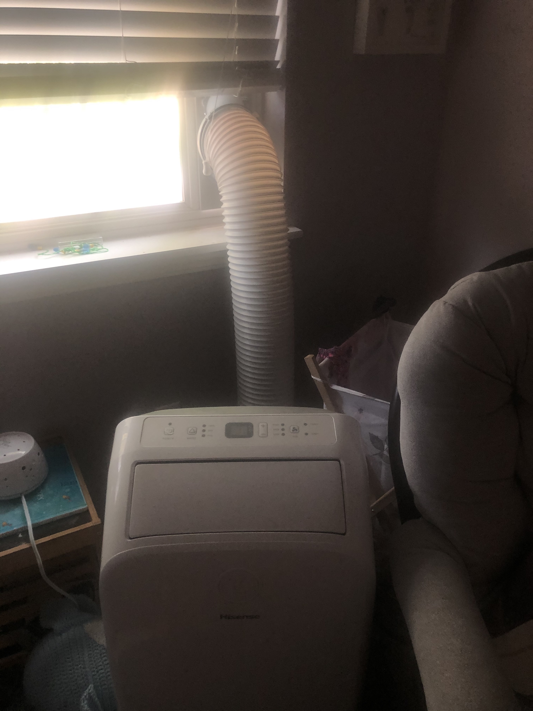
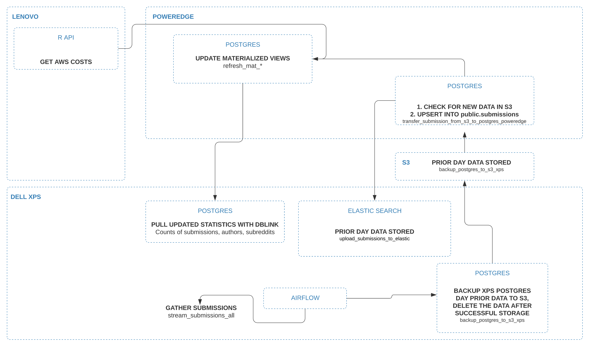

# NDEXR - Indexing the Reddit Platform

## Visit the [Live Site](http://ndexr.com)

## About This Project
Reddit has become one of the most frequently visited websites on the web. At the current time, according
to [Ahrefs](https://ahrefs.com/blog/most-visited-websites/) Reddit is the 7th most popular website in the world. As a 
decentralized platform, moderators are expected to do the policing of their subreddits. However, anyone can create
a subreddit and anyone can receive an API token - which to this date, allows access indistinguishable from a normal user.

Given that we have near exclusive access to Reddit data, what can we do with it? Some thoughts - 

1. Models can help determine bad actors on the platform
2. The duration of high impact national events can potentially be determined - tend to follow a log normal distribution
3. The API creates the opportunity to learn about data engineering best practices with real-time data
4. A team can learn group collaboration
5. The platform built translates to real world needs in other areas

### Bots

We frequently encounter bots on the platform. Some of the most common ones are designed to make sure a post is following 
the appropriate guidelines for the subreddit - i.e., did the post contain correct content, headers - did the author have 
karma (internet points) to post, etc. This is done by looking at the submission data and the data about the author which is 
publicly available.

Bots can do everything a human can do, including guilding which is a paid badge to a user for good content and removal
of ads for the user for a given time.

### Trolls
Trolls are human actors which intentionally work to mislead or aggravate people. A troll can change the tone of the conversation and
generally speaking do not add context or nuance to otherwise well intentioned discussions.

## Observing a World Event

Hourly submissions to Reddit mentioning George Floyd - could distributions like this one help determine the
 duration of a political movement?


This is a log-scale look at the number of different links submitted to Reddit vs the number of Subreddits observed fir a single author.
Sampled 10,000 authors from approx 5 million authors.


Are some of these authors bots or not? Can we determine this? If we can, then what can we say about them?

## The Network

All incoming ports are blocked to external users except for 80 and 3000, the remaining ports are only accessible
 to approved IP addresses.

## My Programming History

I worked at a company called Digital First Media. I was hired on as a data optimization engineer. 
The job was primary working on their optimization code for online marketing campaigns. As the guy in-between, I worked
with qualified data engineers on one side of me and creative web developers on the other side.
 
[Duffy](https://github.com/duffn) was definitely one of the talented ones and taught me quite a bit. While I was with 
the company, one of my complaints was related to how much we were spending for tools we could easily make in house. Of 
of those choices, was whether to buy RSConnect or not. I found a way to build highly scalable R APIs using 
docker-compose and NGINX. Duffy was the guy who knew what was needed for a solution, so he gave me quite a bit of 
guidance in understanding good infrastructure. 

So that's where I learned about building really cool APIs so that I could share my output with non-R users. People used 
my APIs, Duffy was doing cool stuff in Data Engineering and was getting the data to me. 

I gravitated a bit out of the math into the tools Data Engineers used, and became interested in Python, 
SQL, Airflow etc. These guys spin up that stuff daily, so it's not impossible to learn! I started creating data 
pipelines, which grew - and became difficult to maintain. I wanted to learn best practices in data engineering - because 
when things break, it's devastating and a time sink and kept me up nights.  

AIRFLOW, is one of the tools for this job. It makes your scheduled jobs smooth like butter, and is highly transparent 
with the health of your network, and allows for push button runs of your code. This was far superior to cron jobs 
kicking off singular scripts.

## What's Running it

### Dell XPS and Lenovo Ideapad (hangin out in the kitchen)

### Dell Poweredge (40 cores and 128gb)

### Between the AC below and PowerEdge above, I have to choose one.... stupid


The main components are 

1. An Airflow instance running scripts for data gathering.
2. A Postgres database to store the data, with scheduled backups to AWS S3.
3. An R Package I wrote for talking to AWS called `biggr` (using a Python backend - its an R wrapper for
 `boto3` using Reticulate)
4. An R Package I wrote for talking to Reddit called `redditor`  (using a Python backend - its an R wrapper for `praw` using Reticulate)  
5. An R API that converts the data generated by this pipeline to a front end application for display
6. A React Application which takes the data in the R API and displays it on the web.

## You will Need
1. Reddit API authentication
2. AWS IAM Creds (Not always)
3. Motivation to learn Docker, PostgreSQL, MongoDB, Airflow, R Packages using Reticulate, NGINX, 
 and web design.
4. Patience while Docker builds
5. An interest in programming
6. A pulse
7. Oxygen
8. Oreos

## Getting Started 
1. Request permission from `fdrennan` in [NDEXR Slack](https://app.slack.com/client/TAS9MV5K2) for [RStudio](http://ndexr.com:8787) and Postgres access.
2. Get your own set of Reddit API credentials from [Reddit](https://ssl.reddit.com/prefs/apps/) 
2. `FORK` this repository to your Github account
3. Run `git clone https://github.com/YOUR_GITHUB_USERNAME/ndexr-platform.git`
4. RUN `git remote add upstream https://github.com/fdrennan/ndexr-platform.git`
4. RUN `cd ndexr-platform`
5. RUN `docker build -t redditorapi --file ./DockerfileApi .`
6. RUN `docker build -t rpy --file ./DockerfileRpy .`
7. RUN `docker build -t redditorapp --file ./DockerfileShiny .`

#### Once these steps are complete, contact me to see how to set your environment variables.
```
POSTGRES_USER=yournewusername
POSTGRES_PASSWORD=yourstrongpassword
POSTGRES_HOST=ndexr.com
POSTGRES_PORT=5433
POSTGRES_DB=postgres
REDDIT_CLIENT=yourclient
REDDIT_AUTH=yourauth
USER_AGENT="datagather by /u/username"
USERNAME=usernameforreddit
PASSWORD=passwordforreddit
```

## About the Dockerfiles
There are three dockerfiles that are needed: `DockerfileApi`, `DockerfileRpy`, and `DockerfileUi`

`DockerfileApi` is associated with the container needed to run an R [Plumber](https://www.rplumber.io/) API. 
In the container I take from [trestletech](https://hub.docker.com/r/trestletech/plumber/), I add on some additional 
Linux binaries and R packages. There are two R packages in this project. One is called [biggr] and the other is called 
[redditor], which are located in `./bigger` and `./redditor-api` respectively. To build the container, run the 
following:

```
docker build -t redditorapi --file ./DockerfileApi .
```

`DockerfileRpy` is a container running both R and Python, This is taken from the `python:3.7.6` container. I install R 
on top of it, so I can run scheduled jobs. This container runs Airflow, which is set up in `airflower`. Original name, 
right? 

```
docker build -t rpy --file ./DockerfileRpy .
```

This container contains code and packags required to run the Shiny application

```
docker build -t redditorapp --file ./DockerfileShiny .
```
### The main DAG, man
1. `set_up_aws`: Update AWS credentials on file for `biggr`
2. `backup_postgres_to_s3`: Moves recent submission data from the XPS server to S3
3. `transfer_subissions_from_s3_to_poweredge`: Grabs the data in S3 and stages for long term storage on the Poweredge 
in Postgres at `public.submissions`.
4. `upload_submissions_to_elastic`: takes all submissions not stored in elastic search and saves them there - running on the `Dell XPS` laptop
5. `refresh_*`: are all materialized views that get updated on the Poweredge once received from the S3 bucket
6. `poweredge_to_xps_meta_statistics`: takes the submission, author, and subreddit counts and stored in the `XPS` Postgres database. 
This allows for updated statistics when the Poweredge server is off. 
7. `update_costs`: Once the ETL process is done, grab the latest costs from AWS and store in the DB.


### More Detail into the Airflow Process



# Hop Into A Container

```
docker exec -it  [container name]  bash
```

# Backing Up Your Data
```
psql -U airflow postgres < postgres.bak
```

```
scp -i "~/ndexr.pem" ubuntu@ndexr.com:/var/lib/postgresql/postgres/backups/postgres.bak postgres.bak
docker exec redditor_postgres_1 pg_restore -U airflow -d postgres /postgres.bak
```


# Dont run these unless you know what you are doing. Im serious.
```
docker stop $(docker ps -a -q)
docker rm $(docker ps -a -q)
docker volume prune
docker volume rm  redditor_postgres_data
```

# Restoring Postgres from Backup
```
pg_dump -h db -p 5432 -Fc -o -U postgres postgres > postgres.bak
wget https://redditor-dumps.s3.us-east-2.amazonaws.com/postgres.tar.gz
tar -xzvf postgres.tar.gz
```


## Restore Database
1. Run Gathering Dag
2. Run this
```

  redditor_postgres  /bin/bash 
tar -zxvf /data/postgres.tar.gz
pg_restore --clean --verbose -U postgres -d postgres /postgres.bak
# /var/lib/postgresql/data
```
 
# Creating Connections from Local Servers to Remote Servers

### To Kill a port
`sudo fuser -k -n tcp 3000`


### Allowing Port Forwarding
```
sudo systemctl restart ssh
sudo vim /etc/ssh/sshd_config

/var/log/secure
AllowTcpForwarding yes
GatewayPorts yes

### Kill Autossh

pkill -3 autossh
ps aux | grep ssh
kill -9 28186 14428

```

### LENOVO
```
autossh -f -nNT -i /home/fdrennan/ndexr.pem -R 61209:localhost:61208  ubuntu@ndexr.com -o UserKnownHostsFile=/dev/null -o StrictHostKeyChecking=no -o ExitOnForwardFailure=yes
autossh -f -nNT -i /home/fdrennan/ndexr.pem -R 2300:localhost:22  ubuntu@ndexr.com -o UserKnownHostsFile=/dev/null -o StrictHostKeyChecking=no -o ExitOnForwardFailure=yes
autossh -f -nNT -i /home/fdrennan/ndexr.pem -R 8999:localhost:8999  ubuntu@ndexr.com -o UserKnownHostsFile=/dev/null -o StrictHostKeyChecking=no -o ExitOnForwardFailure=yes
autossh -f -nNT -i /home/fdrennan/ndexr.pem -R 3000:localhost:3000 ubuntu@ndexr.com -o UserKnownHostsFile=/dev/null -o StrictHostKeyChecking=no -o ExitOnForwardFailure=yes
autossh -f -nNT -i /home/fdrennan/ndexr.pem -R 8005:localhost:8005 ubuntu@ndexr.com -o UserKnownHostsFile=/dev/null -o StrictHostKeyChecking=no -o ExitOnForwardFailure=yes
autossh -f -nNT -i /home/fdrennan/ndexr.pem -R 8002:localhost:8002 ubuntu@ndexr.com -o UserKnownHostsFile=/dev/null -o StrictHostKeyChecking=no -o ExitOnForwardFailure=yes
autossh -f -nNT -i /home/fdrennan/ndexr.pem -R 8003:localhost:8003 ubuntu@ndexr.com -o UserKnownHostsFile=/dev/null -o StrictHostKeyChecking=no -o ExitOnForwardFailure=yes
autossh -f -nNT -i /home/fdrennan/ndexr.pem -R 8004:localhost:8004 ubuntu@ndexr.com -o UserKnownHostsFile=/dev/null -o StrictHostKeyChecking=no -o ExitOnForwardFailure=yes
autossh -f -nNT -i /home/fdrennan/ndexr.pem -R 8006:localhost:8006 ubuntu@ndexr.com -o UserKnownHostsFile=/dev/null -o StrictHostKeyChecking=no -o ExitOnForwardFailure=yes
```

### DELL XPS
```
autossh -f -nNT -i /home/fdrennan/ndexr.pem -R 61210:localhost:61208 ubuntu@ndexr.com -o UserKnownHostsFile=/dev/null -o StrictHostKeyChecking=no -o ExitOnForwardFailure=yes
autossh -f -nNT -i /home/fdrennan/ndexr.pem -R 8080:localhost:8080 ubuntu@ndexr.com -o UserKnownHostsFile=/dev/null -o StrictHostKeyChecking=no -o ExitOnForwardFailure=yes
autossh -f -nNT -i /home/fdrennan/ndexr.pem -R 2500:localhost:22  ubuntu@ndexr.com -o UserKnownHostsFile=/dev/null -o StrictHostKeyChecking=no -o ExitOnForwardFailure=yes
autossh -f -nNT -i /home/fdrennan/ndexr.pem -R 9200:localhost:9200 ubuntu@ndexr.com -o UserKnownHostsFile=/dev/null -o StrictHostKeyChecking=no -o ExitOnForwardFailure=yes
autossh -f -nNT -i /home/fdrennan/ndexr.pem -R 8081:localhost:8081 ubuntu@ndexr.com -o UserKnownHostsFile=/dev/null -o StrictHostKeyChecking=no -o ExitOnForwardFailure=yes
```

### POWEREDGE
```
autossh -f -nNT -i /home/fdrennan/ndexr.pem -R 61211:localhost:61208   ubuntu@ndexr.com -o UserKnownHostsFile=/dev/null -o StrictHostKeyChecking=no -o ExitOnForwardFailure=yes
autossh -f -nNT -i /home/fdrennan/ndexr.pem -R 8001:localhost:8001 ubuntu@ndexr.com -o UserKnownHostsFile=/dev/null -o StrictHostKeyChecking=no -o ExitOnForwardFailure=yes
autossh -f -nNT -i /home/fdrennan/ndexr.pem -R 8000:localhost:8000   ubuntu@ndexr.com -o UserKnownHostsFile=/dev/null -o StrictHostKeyChecking=no -o ExitOnForwardFailure=yes
autossh -f -nNT -i /home/fdrennan/ndexr.pem -R 2400:localhost:22  ubuntu@ndexr.com -o UserKnownHostsFile=/dev/null -o StrictHostKeyChecking=no -o ExitOnForwardFailure=yes
autossh -f -nNT -i /home/fdrennan/ndexr.pem -R 8787:localhost:8787 ubuntu@ndexr.com -o UserKnownHostsFile=/dev/null -o StrictHostKeyChecking=no -o ExitOnForwardFailure=yes
autossh -f -nNT -i /home/fdrennan/ndexr.pem -R 5433:localhost:5432 ubuntu@ndexr.com -o UserKnownHostsFile=/dev/null -o StrictHostKeyChecking=no -o ExitOnForwardFailure=yes
```

# Uploading to Docker
```
docker image tag rpy:latest fdrennan/rpy:latest
docker push fdrennan/rpy:latest

docker image tag redditorapi:latest fdrennan/redditorapi:latest
docker push fdrennan/redditorapi:latest
```

# Reset Everything Docker
```
docker stop $(docker ps -a -q)
docker rm $(docker ps -a -f status=exited -q)
docker rmi $(docker images -a -q)
docker volume prune
```

# Add user
```
sudo adduser newuser
usermod -aG sudo newuser
```
# Useful LInks
##[Port Scanner](https://gf.dev/port-scanner)
##[Install Elastic Search Plugins](https://serverfault.com/questions/973325/how-to-install-elasticsearch-plugins-with-docker-container)

##[Monitoring Users](https://www.ostechnix.com/monitor-user-activity-linux/)

# Technologies Used


# Docker Files
```
docker build -t redditorapi --build-arg DUMMY={DUMMY} --file ./DockerfileApi .
docker build -t rpy --build-arg DUMMY={DUMMY} --file ./DockerfileRpy .
docker build -t redditorapp --build-arg DUMMY={DUMMY} --file ./DockerfileShiny .
```

# Delete a User
```.env
sudo userdel -r username
```